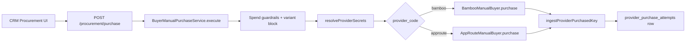
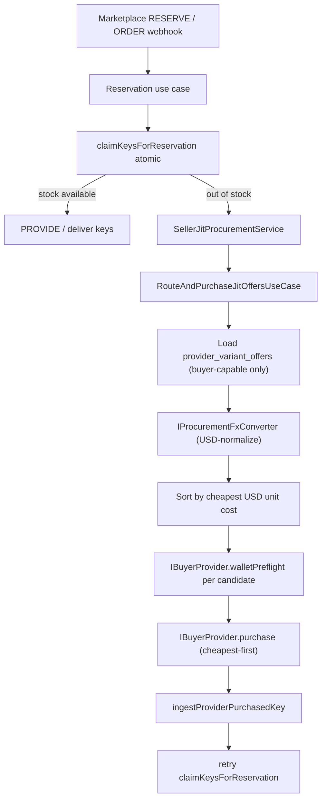
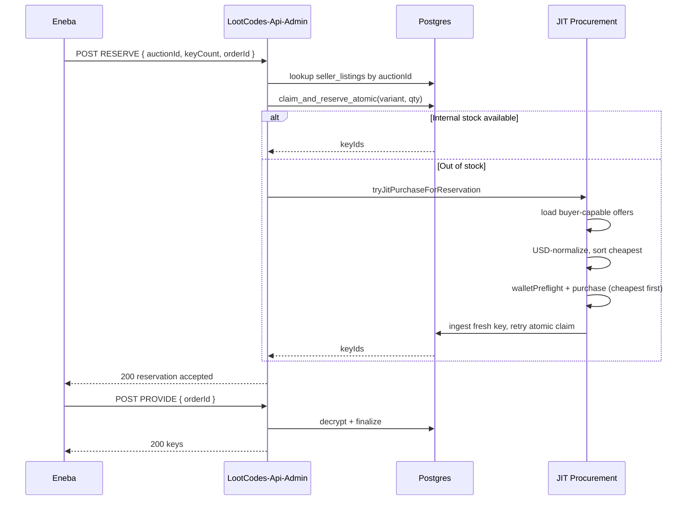

# Procurement architecture

This document maps how LootCodes-Api-Admin sources keys, both manually and
automatically (JIT) when an external marketplace asks us to fulfil a sale.

---

## 1. Two procurement entry points

### 1.1 Manual procurement (`POST /procurement/purchase`)

Triggered from the CRM Procurement UI when an operator clicks **Buy** on a
linked `provider_variant_offers` row.

- Route: see `src/http/routes/procurement.routes.ts` → calls
  `BuyerManualPurchaseService.execute`.
- Service: `src/infra/procurement/buyer-manual-purchase.service.ts`.
- Operator picks an explicit provider + offer; no auto-routing.
- Supported providers today: **Bamboo**, **AppRoute**.
- Path on success: provider is charged → keys are returned → ingested via
  `ingestProviderPurchasedKey` → row inserted in `provider_purchase_attempts`.

### 1.2 Seller-side JIT procurement (Eneba/Kinguin RESERVE)

Triggered when a declared-stock marketplace asks us to fulfil a sale and we
have **no internal key**. The atomic claim RPC fails → the seller flow falls
back to JIT, buys from the cheapest viable buy-side provider, ingests the
key, then retries the atomic claim.

- Eneba RESERVE entry: `src/core/use-cases/seller-webhook/eneba/handle-declared-stock-reserve.use-case.ts`.
- Atomic claim port: `ISellerKeyOperationsPort.claimKeysForReservation`.
- JIT fallback: `src/infra/seller/seller-jit-procurement.service.ts` →
  delegates to `RouteAndPurchaseJitOffersUseCase`
  (`src/core/use-cases/procurement/route-and-purchase-jit-offers.use-case.ts`).

---

## 2. Per-marketplace seller webhook flows

Source folder: `src/core/use-cases/seller-webhook/`.

| Marketplace | Listing model | Files |
| --- | --- | --- |
| **Eneba** | Declared-stock | `eneba/handle-declared-stock-reserve.use-case.ts`, `eneba/handle-declared-stock-provide.use-case.ts`, `eneba/handle-declared-stock-cancel.use-case.ts` |
| **Gamivo** | Reservation + on-demand keys | `gamivo/handle-gamivo-reservation.use-case.ts`, `gamivo/handle-gamivo-get-keys.use-case.ts`, `gamivo/handle-gamivo-order.use-case.ts`, `gamivo/handle-gamivo-refund.use-case.ts`, `gamivo/handle-gamivo-offer-deactivation.use-case.ts` |
| **G2A** | Reservation + inventory pull | `g2a/handle-g2a-reservation.use-case.ts`, `g2a/handle-g2a-cancel-reservation.use-case.ts`, `g2a/handle-g2a-renew-reservation.use-case.ts`, `g2a/handle-g2a-get-inventory.use-case.ts`, `g2a/handle-g2a-return-inventory.use-case.ts`, `g2a/handle-g2a-order.use-case.ts`, `g2a/handle-g2a-notifications.use-case.ts` |
| **Kinguin** | Pre-uploaded keys | `kinguin/handle-kinguin-webhook.use-case.ts`, `kinguin/handle-kinguin-buyer-webhook.use-case.ts` |
| **Digiseller** | Pre-uploaded with quantity check | `digiseller/handle-digiseller-quantity-check.use-case.ts`, `digiseller/handle-digiseller-delivery.use-case.ts` |
| **Bamboo (callback)** | Buyer-side callback | `bamboo/handle-bamboo-callback.use-case.ts` |

Eneba's `RESERVE → PROVIDE → CANCEL` is the canonical declared-stock flow:

---

## 3. Buy-side data model

Tables touched by procurement (`public` schema):

| Table | Role |
| --- | --- |
| `provider_accounts` | One row per supplier (Bamboo, AppRoute, Eneba, …). `is_enabled`, `supports_seller`, `api_profile`, `seller_config`. |
| `provider_secrets_ref` | API keys / OAuth credentials. Read via `resolveProviderSecrets`. |
| `provider_product_catalog` | Cached supplier catalog (price snapshots used as fallback when offer rows are missing). |
| `provider_variant_offers` | Linked offer rows: `(variant_id, provider_account_id, external_offer_id, currency, last_price_cents, available_quantity, prioritize_quote_sync, is_active)`. **The cheapest-router reads from here**. |
| `provider_purchase_attempts` | Per-purchase audit + idempotency. Columns: `provider_request_id`, `status`, `provider_order_ref`, `error_code/message`, `response_snapshot`, `manual_admin_user_id`. |
| `provider_purchase_queue` | Background buy-on-stockout queue (separate from JIT — used by storefront fulfilment, not seller-side). |
| `provider_price_history` | Historical price snapshots from quote-refresh. |
| `currency_rates` | USD↔X exchange rates used to normalize candidate offers in `IProcurementFxConverter`. |

---

## 4. Cheapest-provider routing (this PR)

`RouteAndPurchaseJitOffersUseCase` algorithm:

1. Load active offers for `variantId` joined to `provider_accounts` filtered
   to `is_enabled = true AND supports_seller = false` (buy-side only).
2. For every offer, normalize to USD via `IProcurementFxConverter.toUsdCents`.
   Drop offers with no rate.
3. Apply **profitability gate**: `usdUnitCost ≤ salePriceCents − minMarginCents − feesCents`.
4. Apply **stock gate**: `available_quantity` ≥ requested qty (when known).
5. Sort by ascending USD unit cost (tie-break by `prioritize_quote_sync`).
6. For each candidate (cheapest-first):
   - Resolve `IBuyerProvider` from `IBuyerProviderRegistry`. Skip if the
     provider has no buyer adapter wired.
   - `walletPreflight(unitCents, quantity, currency)`. Skip on `ok: false`.
   - Call `purchase(req)`. Return success on the first one that ingests keys.
7. Return `false` if no candidate succeeds → caller propagates variant
   unavailability (admin alert).

---

## 5. Capability matrix

| Provider | Catalog | Find by id | Balance | Shop order | DTU order | DTU check | List orders | JIT-eligible (buy-side) |
| --- | :-: | :-: | :-: | :-: | :-: | :-: | :-: | :-: |
| **Bamboo** | yes | yes | yes (live wallets) | yes | n/a | n/a | yes (poll) | yes |
| **AppRoute** | yes | yes | yes (`GET /accounts`) | yes | yes (this PR) | yes (this PR) | yes | yes |
| **Eneba** | seller only | — | — | — | — | — | — | no (sell-side) |
| **Kinguin** | seller only | — | — | — | — | — | — | no (sell-side) |
| **G2A** | seller only | — | — | — | — | — | — | no (sell-side) |
| **Gamivo** | seller only | — | — | — | — | — | — | no (sell-side) |
| **Digiseller** | seller only | — | — | — | — | — | — | no (sell-side) |

JIT eligibility is determined at runtime by `provider_accounts.supports_seller = false`.

---

## 6. Manual vs JIT — single source of truth

Both paths funnel through the same buyer adapters:

- `BambooManualBuyer` (catalog + checkout + poll).
- `AppRouteManualBuyer` (orders + poll + unhide).

The `IBuyerProvider` port wraps each so the JIT router can treat them
uniformly without leaking adapter-specific quirks (Bamboo's `walletCurrency`,
AppRoute's `referenceId` UUID hashing).
